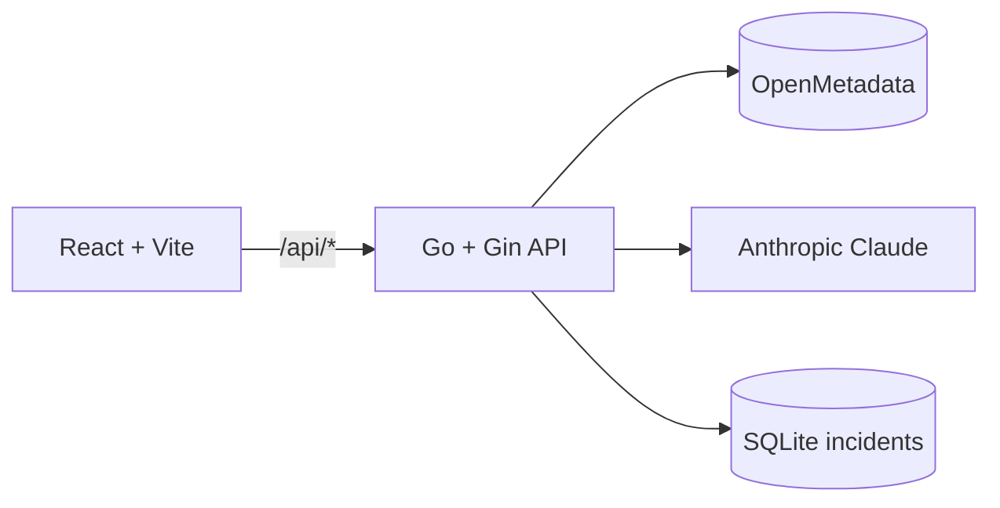

# DataStory

**DataStory** turns [OpenMetadata](https://open-metadata.org/) into human-readable **data incident reports**: lineage and data quality signals become a single brief engineers and stakeholders can act on—optionally rewritten by **Claude**, with a **deterministic fallback** so demos and production stay usable without an LLM key.

**Repository:** [github.com/bansalbhunesh/Datastory](https://github.com/bansalbhunesh/Datastory)

---

## Why this exists (problem)

When something breaks in the data layer, teams lose time in fragmented views: lineage graphs, quality dashboards, Slack threads, and ad-hoc SQL. The **metadata already knows** upstream/downstream impact and which tests failed—but that knowledge rarely becomes a **shared narrative** everyone can understand under pressure.

## What DataStory does (solution)

1. **Discover** the right table (OpenMetadata search).
2. **Pull context**: lineage + data quality test cases for that entity.
3. **Draft** a structured incident report (facts-first markdown).
4. **Optionally enhance** the wording with Claude; if the LLM is missing, misconfigured, or fails validation, you still get a **deterministic** report with clear `warnings`.

The UI supports search, report generation, lineage debug views, and **incident history** so patterns are visible across runs.

---

## Hackathon / “Back to Metadata” angle

OpenMetadata is not only a catalog here—it is the **source of truth** for incident reasoning. Search, lineage, and quality APIs ground every report in **observable metadata**, reducing guesswork and making “what broke and who is affected” easier to communicate. That is metadata as **operational intelligence**, not passive documentation.

---

## Architecture



| Layer | Role |
|--------|------|
| **Frontend** | React, Vite, Tailwind; calls `/api/*` (dev proxy to backend). Optional `VITE_API_KEY` → `X-API-Key` when backend auth is enabled. |
| **Backend** | Gin HTTP server: OpenMetadata client (retries, auth), report orchestration, TTL cache, rate limits, optional API key middleware. |
| **OpenMetadata** | Table search, lineage, data quality test cases. |
| **LLM** | Rewrites / polishes markdown from a deterministic draft; severity stays rule-based. |
| **Incidents** | SQLite-backed store for historical incident entries (`INCIDENT_LOG_PATH`). |

Design highlights (see `backend/README.md` for detail):

- **Deterministic-first**: facts from OpenMetadata → draft report; LLM **rewrites**, it does not invent severity.
- **Parallel fetches** where possible, **TTL cache** for latency, **retries** on transient OpenMetadata errors.
- **Structured logging** with `X-Request-ID` for traceability.

---

## Quick start

### Prerequisites

- **Go** (see `backend/go.mod` for version)
- **Node.js** + npm (for the frontend)
- **Docker** + Docker Compose (for local OpenMetadata quickstart)

### 1. Environment

Copy the template and fill values:

```bash
cp .env.example .env
```

| Variable | Required | Notes |
|----------|----------|--------|
| `OM_BASE_URL` | Yes | OpenMetadata base URL (no trailing slash required; trimmed at runtime). |
| `OM_TOKEN` **or** `OM_EMAIL` + `OM_PASSWORD` | Yes | JWT from OpenMetadata UI **or** login credentials. Token wins if both are set. |
| `CLAUDE_API_KEY` | No | Enables Claude; omit for deterministic-only mode. |

**Where to get OpenMetadata values**

- **`OM_BASE_URL`**: URL of your OpenMetadata server (local quickstart: `http://localhost:8585`).
- **`OM_TOKEN`**: OpenMetadata UI → profile / settings → generate or copy API/JWT token (preferred for automation).
- **`OM_EMAIL` / `OM_PASSWORD`**: Your OpenMetadata login; local quickstart often uses `admin@open-metadata.org` / `admin` if unchanged.

Additional server tuning lives in `backend/.env.example` (`LOG_LEVEL`, `ALLOWED_ORIGINS`, `API_KEY`, rate limits, `FRONTEND_DIST` for SPA serving, etc.).

### 2. Install dependencies

```bash
make install
```

### 3. Start OpenMetadata (local demo)

```bash
make mock
```

Uses the pinned quickstart compose under `docker/openmetadata/docker-compose.yml`. Official docs: [Local Docker Deployment](https://docs.open-metadata.org/quick-start/local-docker-deployment).

### 4. Run the app

```bash
make dev
```

- **Frontend:** [http://localhost:5173](http://localhost:5173) — Vite proxies `/api` and `/healthz` to `http://127.0.0.1:8080`.
- **Backend:** [http://localhost:8080](http://localhost:8080)

`make dev` runs backend and frontend in parallel (**GNU Make** required). Alternatively:

```bash
# terminal 1
cd backend && go run ./cmd/server

# terminal 2
cd frontend && npm run dev
```

### 5. Tear down OpenMetadata (optional)

```bash
make mock-down
```

---

## API reference

| Method | Path | Purpose |
|--------|------|---------|
| `GET` | `/healthz` | Liveness probe |
| `GET` | `/api/health` | JSON `{ "ok": true }` |
| `GET` | `/api/ready` | OpenMetadata reachability + auth + Claude configured |
| `GET` | `/api/search/tables?q=…` | Table search hits (autocomplete) |
| `POST` | `/api/generate-report` | Generate incident report (JSON body) |
| `GET` | `/api/debug/lineage?q=…` | Lineage sanity check (summary + raw JSON) |
| `GET` | `/api/incidents?tableFQN=…&limit=…` | List stored incident history for a table |

**Generate report** — body examples:

```json
{ "query": "dim_address" }
```

```json
{ "tableFQN": "service.database.schema.table" }
```

Response includes `source`: `claude` or `deterministic`, plus `warnings[]` when fallbacks apply.

---

## OpenMetadata APIs used

| Capability | Endpoint (conceptual) | Docs |
|------------|------------------------|------|
| Search | `GET /api/v1/search/query` | [Search](https://docs.open-metadata.org/latest) |
| Lineage | `GET /api/v1/lineage/table/name/{fqn}` | [Lineage](https://docs.open-metadata.org/v1.12.x/api-reference/lineage/get) |
| Data quality | `GET /api/v1/dataQuality/testCases?entityLink=…` | [Test cases](https://docs.open-metadata.org/v1.12.x/api-reference/data-quality/test-cases) |

---

## Deployment notes

### Render

`render.yaml` defines a **web** service (`rootDir: backend`) that builds the frontend, copies `dist` into the backend, compiles the Go binary, and sets sensible defaults (`FRONTEND_DIST`, `INCIDENT_LOG_PATH`, `ALLOWED_ORIGINS`, etc.). Set secrets in the Render dashboard: **`OM_BASE_URL`**, **`OM_EMAIL`** / **`OM_PASSWORD`** (or **`OM_TOKEN`**), and optionally **`CLAUDE_API_KEY`**. Render injects **`PORT`** automatically; the server reads `PORT` or `BACKEND_PORT`.

### Vercel (frontend-only) + API elsewhere

If the UI is on Vercel and the API on Render (or another host), configure **rewrites** so browser calls to `/api/*` reach your backend origin, and set **`ALLOWED_ORIGINS`** on the backend to your Vercel URL. If you enable **`API_KEY`** on the server, set **`VITE_API_KEY`** in Vercel to the same value (sent as `X-API-Key`).

---

## Repository layout

| Path | Contents |
|------|-----------|
| `backend/` | Go service: `cmd/server`, `internal/api`, `internal/services`, OpenMetadata + LLM clients |
| `frontend/` | Vite + React + Tailwind UI; `src/mock/sampleReport.ts` helps offline demos |
| `docker/openmetadata/` | OpenMetadata quickstart Compose |
| `Makefile` | `make dev`, `make mock`, `make mock-down`, `make install` |
| `render.yaml` | Example Render blueprint |

---

## Development

```bash
make test                  # backend + frontend tests
make lint                  # go vet
make build                 # production binary that serves the SPA from /
cd backend  && make test   # backend only (race detector enabled)
cd frontend && npm test    # frontend only (Vitest + Testing Library)
```

The integration test in `backend/internal/api/integration_test.go` boots the
full router (middleware + handlers + report service + SQLite store) against a
fake OpenMetadata server and exercises every public endpoint — including the
sanitized error response, async incident persistence, oversized-body limit,
and SPA path-traversal containment.

More backend internals: [`backend/README.md`](backend/README.md).

---

## Learning and tradeoffs

Shipping a hackathon project that **depends on metadata** but **does not depend on AI uptime** forced clear boundaries: OpenMetadata owns facts; the LLM improves language. That keeps the demo credible under judge time pressure and mirrors how real teams should treat LLMs in incident tooling.

---

## Hackathon submission cheat sheet

Use this for forms, demos, and judges who want a **≤ 3 minute** walkthrough.

### Environment checklist (local)

| Step | Action |
|------|--------|
| 1 | `cp .env.example .env` (repo root; backend also reads `backend/.env` if you use it) |
| 2 | Set `OM_BASE_URL` to your OpenMetadata URL (e.g. `http://localhost:8585`) |
| 3 | Set **`OM_TOKEN`** *or* **`OM_EMAIL`** + **`OM_PASSWORD`** |
| 4 | Optional: `CLAUDE_API_KEY` for AI-enhanced wording (omit to show deterministic mode) |
| 5 | `make mock` → wait for OpenMetadata to be healthy → `make install` → `make dev` |

**Smoke checks:** open [http://localhost:5173](http://localhost:5173) → status should show OpenMetadata reachable; try [http://localhost:8080/api/ready](http://localhost:8080/api/ready) for raw JSON.

### One-take demo script (~3 min)

| Time | Say / do |
|------|-----------|
| **0:00–0:25** | **Problem:** data incidents scatter context across lineage, quality tools, and chat. **Solution:** DataStory pulls OpenMetadata search + lineage + quality into one incident brief. |
| **0:25–0:55** | **Stack:** React + Vite UI, Go + Gin API, OpenMetadata REST, optional Claude; SQLite for incident history. **Design:** deterministic draft first, LLM rewrites—so the demo works without AI. |
| **0:55–2:30** | **Live demo:** search a table → generate report → scroll markdown (impact, lineage context, quality signals) → point at `source: claude` vs `deterministic` and any `warnings`. Optionally open debug lineage or incident list for the same table. |
| **2:30–2:55** | **OpenMetadata usage:** “Every claim is anchored in OM APIs—search, lineage, test cases—not hallucinated structure.” |
| **2:55–3:00** | **Close:** “Metadata becomes operational: faster shared understanding when data breaks.” |

### Suggested talking points (judges)

- **Impact:** shorter path from “something’s wrong” to “who/what is affected and what to check next.”
- **Trust:** severity and facts are system-derived; the LLM only improves language when available.
- **Resilience:** no Claude key required for a credible end-to-end story.

### PR / artifact links

Replace with your real links when submitting:

- Repo: `https://github.com/bansalbhunesh/Datastory`
- PRs: paste each merged or open PR URL (GitHub → Pull requests → copy link)

---

## License

Apache-2.0 is recommended to align with common OpenMetadata ecosystem licensing—adjust if you prefer MIT.
